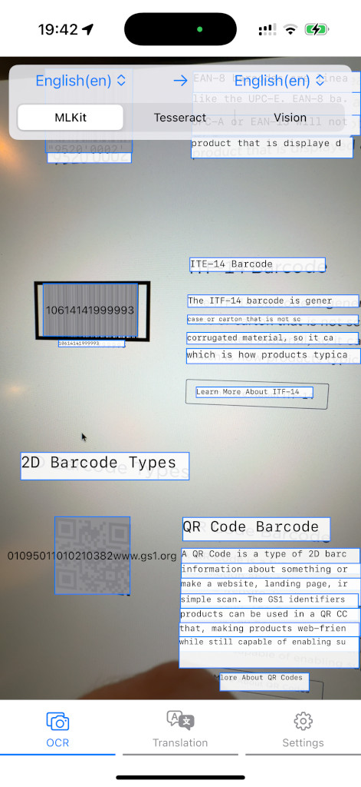
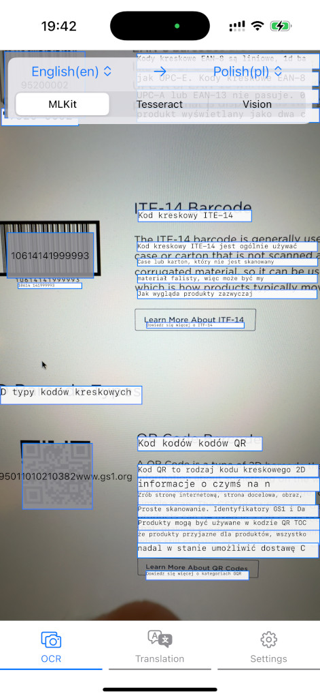

# iOS Offline On-Device Live OCR and Translation Demo Application

This demo project showcases offline live OCR, real-time translation, and barcode scanning capabilities on iOS, powered by Google ML Kit, Apple Vision, and Tesseract.

### Features:
* Offline on-device OCR using ML Kit, Apple Vision, and Tesseract
* Real-time text translation
* Barcode scanning supporting major linear and 2D formats
* Modular architecture for easy replacement and testing of services
* SwiftUI UI framework with ViewModels and global state management

### Technology Stack

* Programming Language: Swift
* UI Framework: SwiftUI
* APIs & Services: Google ML Kit, Apple Vision, Tesseract
* Architecture: Observable global state, abstracted services, service factories, concurrency using async tasks and dispatch queues

### Libraries used:
* Google ML Kit Text Recognition - https://developers.google.com/ml-kit/vision/text-recognition/v2
* Apple Vision Framework - https://developer.apple.com/documentation/vision/recognizing-text-in-images
* Tesseract - https://github.com/tesseract-ocr/tesseract
* Tesseract-OCR-iOS - https://github.com/gali8/Tesseract-OCR-iOS
* ML Kit Barcode Scanner - https://developers.google.com/ml-kit/vision/barcode-scanning
* Google MLKit Translation - https://developers.google.com/ml-kit/language/translation

